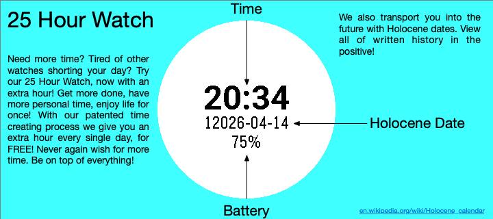
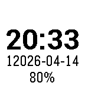
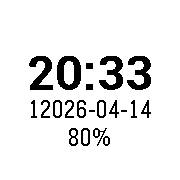
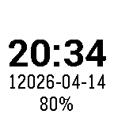
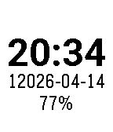
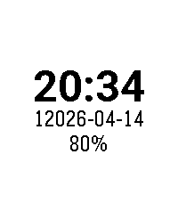
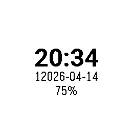

# Hour25 Watchface for Pebble

A unique Pebble watchface that re-imagines time with a 25-hour clock system and a custom date display. This watchface divides the standard 24-hour day into 25 "hours," offering a distinct perspective on timekeeping.

## Features

*   **25-Hour Time Display:** The watchface converts standard time into a 25-hour format. This means a regular 24-hour day is conceptually divided into 25 "hours," where each hour, minute, and second is proportionally shorter than its standard counterpart (e.g., a "25-hour second" is 0.96 standard seconds long).
*   **Custom Date Format:** Displays the current date with a unique "year" format, for example, `12024-MM-DD`, providing a distinct aesthetic.
*   **Battery Indicator:** Shows the current battery percentage. The text color changes to yellow when the battery is below 20% and red when below 10%, giving a quick visual warning.
*   **Hourly Chimes:** Provides a subtle haptic feedback (vibration) on the top of each "25-hour" hour.
*   **Regular Updates:** The time, date, and battery status are updated every 30 seconds to ensure accuracy.

## How it Works

The watchface calculates time on a 25-hour scale by adjusting the duration of each second. A standard 24-hour day (86,400 seconds) is mapped to a 25-hour cycle, meaning each "25-hour second" is `86400 / (25 * 60 * 60) = 0.96` standard seconds.

The date display uses a custom calculation for the year (current year modulo 100 plus 12000) to present a unique, large year number.

## Installation

1.  **Install the Pebble app** on your smartphone if you haven't already.
2.  **Compile the project** to generate a `.pbw` (Pebble Watch Bundle) file.
3.  **Load the `.pbw` file** onto your watch via the Pebble app.

## Code Structure

*   `common.c`: Contains utility functions, such as `clamp`, used across the project.
*   `hour25.c`: Implements the main watchface logic, including the 25-hour time conversion, date formatting, battery display, and timer-based updates.

## Screenshots

| Basalt | Chalk | Diorite |
| -------- | --- | ---- |
|  |  | 
| Flint | Emery | Gabbro
|  |  | 

---

Developed for the Pebble platform.
